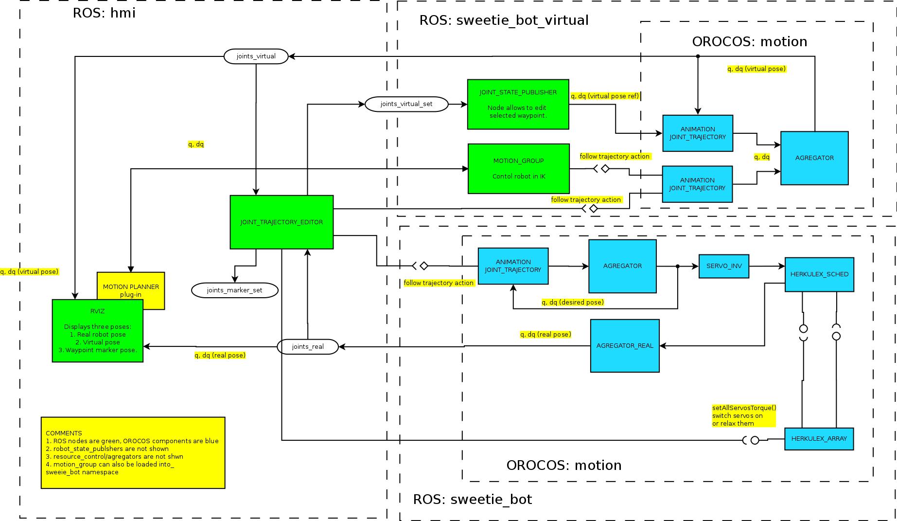

Подсистема исполнения сохраненных движений
===========================================

Подсистема включает в себя несколько задатчиков объединеных общей 
Проводится "обучение" траектории, путем сохранения `JointState` в для заданных контрольных точек (поза и время).
Контрольные точки могут быть указаны путем перемещения конечности робота, либо средствами `rviz`.

Время и прочая метаинформация указывается вручную путем непосредственного редактирования файла траектории.
Такой способ задания выбран, так как трудно вручную провести конечность сразу по заданной траектории в реальном времени.

Затем задатчик загружает набор точек, сглаживает траекторию сплайном в угловой системе координат и проигрывает ее. 

Требования
----------

1. Проигрывание траекторий заданных в угловой СК (на уровне `JointState`) в разных вариантах:
    * траектория передается в виде сообщения,
    * траектория передается в виде сообщения с дополнительной информацией о действиях, задаваемых текстовыми идентификаторам (смена анимации глаз, проигрывание звуков),
    * траектория хранится в файле (с доп. действиями или без) исполняется по сообщению с указанием ее идентификатора.

2. Частичная или полная интеграция с [MoveIt!](http://moveit.ros.org): исполнение траекторий, сохранение их.
    В перспективе использование ее средств для проверки коллизий.

3. Интерактивные средства создания траекторий, путем указания контрольных точек в угловой СК и времени исполнения. 
    Траектории могу снабжаться информацией о дополнительных действиях. 
    * Возможность работы только с моделью робота (траектория исполняется в `rviz`, контрольные точки задаются средствами ROS).
    * Возможность работы с роботом (траектория исполняется роботом, контрольные точки задаются позой).
    * Любое сочетание этих режимов.
    * Формирование файлов с сохраненными траекториями.

Архитектура подсистемы
-----------------------

Для управления движением используются действия `actionlib`.
Это наиболее полно соответствует конечному характеру траектории, позволяет контролировать и прерывать ее исполнение.

### Базовый вариант (без поддержки текстовых действий)

На стороне задатчиков представлен двумя компонентами.
* `AnimationJointTrajectory` --- исполнение действия `control_msgs::FollowJointTrajectory`.
* `AnimationStoredJointTrajectory` --- загружает траектории в виде сообщений `control_msgs::FollowJointTrajectoryGoal` из файлов, 
    исполняет нужную по текстовому действию `TextAction`.
Оба задатчика поддерживают: сопряжение траекторий (за счет [механизма фильтров](library-filters) для `JointState`), отмену исполнения траектории,
переключение на другую траекторию. Набор необходимых ресурсов определяется по списку сочленений при помощи плагина [`RobotModelURDF`](plugin-robotmodel).
Полученная или загруженная траектория приближается сплайнами второго порядка.

На стороне высокого уровня могут функционировать следующие компоненты:
* Подсистема [MoveIt!](http://moveit.ros.org), она способна передавать команды в форме действий `control_msgs::FollowJointTrajectory`.
* Компонент `joint_trajectory_editor`, выполняющий роль GUI для создания траекторий. Его центральный элемент --- список контрольных точек. 
   Он предоставляет пользователю следующие возможности:
   * Редактирование: добавление в список точки (поза в `rviz`, реальная поза), назначение `time_from_start` для точек, редактирование заголовка `FollowJointTrajectory`.
   * Сохранение траектории в файл.
   * Команды: послать траекторию на исполнение, отключить/включить приводы, отключить/включит исполнение траектории приводами робота.
     
Ниже приведена структурная схем подсистемы: 

Она включает с себя 3 подсистемы:  реальный робот (`motion`), виртуальный робот (`motion_virtual`), средства редактирования траектории (`trajectory_editor`).
`joint_trajectory_editor` занимает центральное место в схеме. Он может передавать траекторию на исполнение виртуальному или реальному роботу,
устанавливать позу виртуального (`joints_virtual_set`), включать\выключать приводы реального робота (`setAllServosTorque`, `setRegisterRAM`), что позволяет менять позу вручную, 
добавлять в свой список контрольных точек новые с топиков `joints_marker` и `joints_real`.

При использовании траекторий с информацией о дополнительных командах меняется тип действий `follow_trajectory_action`.

Отдельный вопрос представляет задание позиция суставов, не управляемых редактируемой траекторией. Для реального робота это придется делать 
вручную, отключив приводы. Для виртуального надо предусмотреть проброску неиспользуемых в траектории сочленений в `joints_virtual_set`.

Хранение траекторий предлагается осуществлять за счет встроенных средств cериаллизации ROS. В одном файле --- одна траектория,
имя файла выступает в качестве идентификатора движения. Недостатком такого подхода является сложность с добавлением описания 
к траектории.

### Типы данных

#### Траектория в угловой системе координат

Используются сообщения из [`control_msgs`](http://docs.ros.org/api/control_msgs/html/index-msg.html)

**Семантика**: 
* `control_msg::FollowJointTrajectoryGoal` --- траектория в угловой СК с информацией о требованиях к ее исполнению.
* `control_msg::FollowJointTrajectory` --- действие `actionlib` по исполнению траектории в угловой СК.

**Прагматика**: эти типы сообщений и действий использует действие по исполнению траектории используются `MoveIt!.
Он включает действие `FollowJointTrajectory`, 

Сообщение `FollowJointTrajectoryGoal`:

    trajectory_msgs/JointTrajectory trajectory  // непосредственно траектория, массив JointState, снабженный метками времени
    JointTolerance[] path_tolerance             // допустимая ошибка для каждого сочленения при исполнении
    JointTolerance[] goal_tolerance             // допустимая ошибка для каждого сочленения в конце траектории
    duration goal_time_tolerance                // допустимое отклонение по времени

Поле `path_tolerance` и `goal_time_tolerance` используются для контроля исполнения траектории и проверки начальных условий и контроля ее исполнения. 

#### Текстовое действия

**Семантика**: любое действие, задавемое текстовыи индентификатором. Такие действия могут использованы для
выбора траектории среди сохраненных, выбора анимации изоббражени глаз.

**Замечание**: надо поискать в ROS аналоги.

**Замечание**: возможно расширение за счет введеня параметров в виде пар строка и число или строка и строка.

**`TextCommand`** --- базовая текстовая команда.
 
    # Command text identificator.
    #
    #  * type --- type of action.
    #  * command --- text action identificator.
    string type
    string command

**`TextCommandStamped`** --- текстовая команда, привязанная ко времени. 

    TextActionGoal command
    duration time_from_start

**`TextAction`** --- текстовое действие `actionlib`

 
    TextCommand command
    -
    -
    int32 result
    string result_string
    int32 SUCCESSFUL = 0
    int32 UNKNOWN_COMMAND = -1

*Замечание*: наилучший способ представления `Feedback` и `Result` не ясен из-за разнородности возможных команд.

#### Траектория в угловой СК с текстовыми действиями

**Семантика**: задает движение робота с сопутсвующимими действиями (смены анимаций, режимов работы и т.п.)

**`FollowJointTrajectoryWithActions`*  --- действие `actionlib` для траектории с информацией о дополнителных действиях. 

    FollowJointTrajectoryGoal trajectory
	TextCommandStamped[] text_commands
    -
    FollowJointTrajectoryResult trajectory
    -
    FollowJointTrajectoryFeedback trajectory

**`FollowJointTrajectoryWithActionsGoal`*  --- траектория в угловой СК и информацией о дополнительных действиях.

Задатчик `AnimationJointTrajectory` (исполнение действия `FollowJointTrajectory`)
----------------------------------------------------------------

### Входные порты

Синхронизация

1. `sync` (`TimerEvent`, EventPort) --- синхронизация таймера.

Текущее состояние робота

1. `joints_sorted` (`JointState`) --- состояние робота в угловой СК (желаемая или реальная по датчикам), сообщение отсортирвано по кинематическим цепочкам.

### Выходные порты

Поза робота (gait)

1. `ref_joints` (`JointState`) --- задающее воздействие в угловой системе координат.
1. `ref_support` (`SupportState`) --- ожидаемое распределение веса, всегда ноль для управляемой конечности.

### Параметры

Возможны параметры настройки системы сопряжения траекторий.

### Операции

Предотавляет: действие `control_msg::FollowJointTrajectory`.

Требует: сервис `robot_model`.

### Семантика исполнения

**Получение нового задания**: 
* проверка уловий запуска (поза робота в пределах лимитов из задания), 
* прерывание старого задания,
* построение сплайна по полученной траектории, 
* используя сервис `robot_model` определет набор нужных ресурсов, запрашивает ресурсы.

**Исполнение**: 
* проверяет, что не нарушены лимиты отклонения от траектории, 
* используя кешированный сплайн и прошедшее время, определяет желаемую позицию, 

### Детали реализации

Т.к. компоненты задатчиков будут иметь общий код, то рекомендуется вынести его в родительский класс `AnimationJointTrajectoryBase`, 
общий для всех задатчикоа.

После получения задания траекторию и ее лимиты лучше кэшировать в удобную структуру. В частноси, может понадобится переупорядочивание звеньев,
в соответсвие с принятым порядком.

Для интерполяции предлагается использовать [`alglib`](http://www.alglib.net/interpolation/spline3.php) ([`tinyspline`](https://github.com/retuxx/tinyspline) 
не подходит, т.к. не обеспечивает неравномерные временные интервалы. **Проверить!**).

Лучше использовать алгоритмы [сопряжения  траекторий](library-filters) второго порядка. Реализация должна подразумевать возможость 
легкой замены алгоритма сопряжения, выбора его через параметры, передача параметров ему. Открыт вопрос использвания сервиса OROCOS.

### Ошибки и исключения

Предупреждения:
2. Выход за пределы лимитов по позиции: целль отклоняется.

Ошибки:
1. Несуществующий сустав.

Задатчик `AnimationJointTrajectory` (исполнение действия `FollowJointTrajectory`)
----------------------------------------------------------------

### Входные порты

Синхронизация

1. `sync` (`TimerEvent`, EventPort) --- синхронизация таймера.

Текущее состояние робота

1. `joints_sorted` (`JointState`) --- состояние робота в угловой СК (желаемая или реальная по датчикам), сообщение отсортирвано по кинематическим цепочкам.

### Выходные порты

Поза робота (gait)

1. `ref_joints` (`JointState`) --- задающее воздействие в угловой системе координат.
1. `ref_support` (`SupportState`) --- ожидаемое распределение веса, всегда ноль для управляемой конечности.

### Параметры

1. `string trajectoris_path` --- каталог с фалами траекторий (каталоги?).

Возможны параметры настройки системы сопряжения траекторий.

### Операции

Предотавляет: действие `TextAction` --- выбор траектории по имени.

Требует: сервис `robot_model`.

### Семантика исполнения

**Конфигурация**: загрузка и кэширование всех траекторий из файлов с последующим выбором по имени.

**Получение нового задания**: то же, что в случае `AnimationJointTrajectory`, однако строить сплайн уже не надо: он есть в кэше.

**Исполнение**: совпадает с `AnimationJointTrajectory`.

### Детали реализации

Использует тот же базовый класс и структуры хранения траектории, что `AnimationJointTrajectory`

### Ошибки и исключения

Предупреждения:
2. Выход за пределы лимитов по позиции: целль отклоняется.
1. Файл не читается.

Ошибки:
1. Несуществующая траектория.
1. Несуществующий сустав.

Сохранение движения: нода `JointTrajectoryEditor`
-----------------------------------------------

Предоставляет пользовательский интерфейс для создания траекторий по контрольным точкам. 

### Подписан на топики

* `joints_real` (`JointState`) --- реальная поза робота по датчикам.
* `joints_virtual` (`JointState`) --- поза виртуального робота.
* `joints_marker` (`JointState`) --- поза, задаваемая пользователем.

### Публикует топики

* `joints_virtual_set` (`JointState`) --- команда мгновенного изменения позы виртуального робота.
* `joints_marker_set` (`JointState`) --- команда мгновенного изменения позы, отображаемой интерфейсом пользователя.

### Сервисы

Требует: `deployer_eval` (`string -> bool`) --- заставляет Deployer OROCOS исполнить заданный скипт через сервис `rosdeployer`.
 Это относительно спорный способ доступа к операциям `HerkulexArray`. В будущем нужен компонент-прокси, т.к. ноды ROS не могут напрямую вызывать операции OROCOS.

### Действия 

Требует: `follow_trajectory_virtual` (`FollowJointTrajectory`) --- передать траекторию виртуальному роботу.
Требует: `follow_trajectory` (`FollowJointTrajectory`) --- передать траекторию реальному роботу.

### Параметры

1. `herkulex_array` (`string`) --- имя компонента `HerkulexArray` при использовании `rosdeployer`.

### Семантика исполнения

Копонет предоставляет GUI в виде окна со списком или таблицей контрольных точек и рядом кнопок.
Он реагирует на действия пользователя, осуществяя различные действия.

Компонент обрабатывает только подмножество сочленений, заданных через `Trajectory setup...`. Если не оговорено другого, то из сообщений должны извлекаться только они.

**Диалог "Trajectory setup..."** --- доступ к изменению базовых парметров траектори `FollowJointTrajectoryGoal` через текстовые поля, ввод через пробел
(`name`, `joints_names`, `path_tolerance`, `goal_tolerance`, `goal_time_tolerance`).

**Список/таблица контрольных точек**: удаление точки, редактирование времени, редактирования списка значений углов (не особо надо), пометка начальная точка и конечная точка.
При выделнии пункта посылается сообщение `joints_marker_set`. 

**"Flip direction"** --- меняет местами начальную точку и конечную.

**"Add pose from marker"** --- добавляет в список точек позу `joints_marker`.

**"Add pose from real"** --- добавляет в список точек позу `joints_real`.

**"Set virtual pose"** --- устанавливает позу виртуального робота `joints_virtual_set` из `joints_marker`. Использует полную позу.

**"Turn all servos on/off"** --- отключает/включает приводы робота.

**"Turn all trajectory servos on/off"** --- отключает/включает приводы, входящие в траекторию.

**"Execute virtual"** --- передает траекторию на исполнение задатчику виртуального робота. Результат по получению отображется рядом с кнопкой.
Тректория формируется по текущему содержимому списка от "начальной точки" к "конечной". Это позволяет удобно отлаживать кусок траектории, 
изменять направление.

**"Execute real"** --- передает траекторию на исполнение задатчику реального робота аналогично пункту выше. Результат по получению отображется рядом с кнопкой.

**"Save trajectory...", "Load trajectory..."** --- загрузка и сохранение траектории.

### Детали реализации

Для представления элементов списка следует использовать отдельный тип. Непосредственно `FollowJointTrajectoryGoal` формируется только по соответсвующим командам.
Следует сразу предусмотреть возможность хранения и отображения `TextCommand` и дальнейшей замены `FollowJointTrajectoryGoal` на `FollowJointTrajectoryWithActionsGoal`

Для работы с действиями использовать `SimpleActionClient`, по одному на каждый задатчик.

Вероятно, удобнее всего писать на python. От интерфейса не требуется реальное время.

