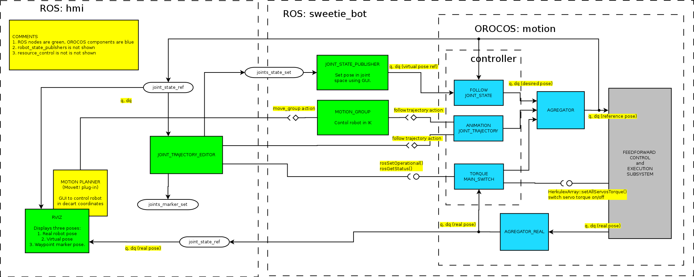

Подсистема исполнения сохраненных движений
===========================================

Подсистема включает в себя интерактивные средства построения траекторий в угловой СК путем задания последовательности контрольных точек 
и задатчики системы управления движением, исполняющие эти траектории. Траектория может снабжаться информацией о контактах.

Эти возможности в основном необходимы для создания анимаций. Сначала робот "обучается" движению путем помещения в ключевые позы,
а затем это движение проигрывается задатчиком по текстовому идентификатору. 

Требования
----------

1. Проигрывание траекторий заданных в угловой СК (на уровне `JointState`) в разных вариантах:
    * траектория передается в виде сообщения,
    * траектория хранится в некотором хранилище исполняется по сообщению с указанием ее идентификатора.
    Интеграция траекторий с сопутсвющими действиями (фразы, смена эмоций) осуществляет высший уровень.

2. Интеграция с [MoveIt!](http://moveit.ros.org): исполнение траекторий, сохранение их.
    В перспективе использование ее средств для проверки столкновений.

3. Интерактивные средства создания траекторий, путем указания контрольных точек в угловой СК и времени исполнения. 
    Траектории могут снабжаться информацией о дополнительных действиях. 
    * Возможность работы только с моделью робота (траектория исполняется в `rviz`, контрольные точки задаются средствами ROS).
    * Возможность работы с роботом (траектория исполняется роботом, контрольные точки задаются позой).
    * Формирование базы данных с сохраненными траекториями для последующего исполнения задатчиками.
	* Задание информации о контактах.

Архитектура подсистемы
-----------------------

Для управления движением используются действия `actionlib`.
Это наиболее полно соответствует конечному характеру траектории, позволяет контролировать и прерывать ее исполнение.

Базовый вариант системы включают:

1. Задатчик `ExecuteJointTrajectory` --- исполнение действия `control_msgs::FollowJointTrajectory`. 
    Он решает задачу интеграции с MoveIt!, может исполянть сохраненные траектории передаваемые, загружемые из хранилища на стороне клиента.
    Задатчик поддерживают сопряжение траекторий (за счет [механизма фильтров](library-filters) для `JointState`), 
    отмену исполнения траектории, переключение на другую траекторию. 
    
    Набор необходимых ресурсов определяется по списку сочленений при помощи плагина [`robot_model`](plugin-robotmodel).
    Полученная траектория приближается сплайнами второго порядка, если это требуетя.

    Совместное исполнение нескольких траекторий достигается загрузкой нескольких экземпляров задатчика.

2. Клиентский код на `python` способный по текстовому идентификатору загружать траекторию из хранилища и передавать ее на исполнение задатчику.
    Хранилище представляет собой список бинарных параметров `rosparam`. Имя параметра играет роль его текстового идентификатора.

3. Компонент `joint_trajectory_editor`, выполняющий роль GUI для создания траекторий. Его центральный элемент --- список контрольных точек. 
   Он предоставляет пользователю следующие возможности:
   * Редактирование: добавление в список точки (виртуального или реального робота), назначение `time_from_start` для точек, редактирование заголовка `FollowJointTrajectory`.
   * Сохранение траектории в хранилище.
   * Команды: послать траекторию на исполнение виртуальному или реальным роботом, отключить/включить приводы.

4. Подсистема [MoveIt!](http://moveit.ros.org), она способна формировать команды в форме действий `control_msgs::FollowJointTrajectory`.
     
Ниже приведена структурная схема системы, используемой для интерактивного построения траекторий: 

(Названия топиков сокращены, реальные названия в соответствие с правилами именования будут: 
`joint_states_ref`: `/motion/agregator_ref/out_joints_sorted`, 
`joint_states`: `/motion/agregator_real/out_joints_sorted` и `/motion/agrgator_real/out_joints`).

Она включает с себя 2 подсистемы:  робот (`sweetie_bot`), средства отображения и редактирования траектории (`hmi`).
Редактор траекторий `joint_trajectory_editor` может передавать траекторию на исполнение через интерфейс `actionlib` задатчику `ExecuteJointTrajectory`,
устанавливать текущую желаемую позу через топик `joint_state_set` и включать/отключать приводы.
Редактор добавлять в свой список контрольных точек новые из топика `joint_state_ref`.

Оператор может менять позу робота, используя интерфейс `joints_state_publisher` или используя графический интерфейс MoveIt!  `motion_control`, подключаемый как плагин `rviz`.
Также можно через интерфейс `joint_trajectory_editor` путем активации задатчика [`torque_main_switch`](components-torque-off) отключить приводы и менять позу вручную.
При этом реальная поза робота через `torque_main_switch` и `agregator_ref` передается в топик `joint_state_ref`.

Траектории хранятся в сериализованном состоянии в виде бинарных параметров ROS в пространстве имен `/joint_trajectory`.
При этом используется [cериализация ROS](http://wiki.ros.org/roscpp/Overview/MessagesSerializationAndAdaptingTypes).
Т.к. в ROS нет стандартных средств сериализации сообщений в человекочитаемый формат, при записи в файл используется
[rospy_message_converter](https://github.com/baalexander/rospy_message_converter), позволяющий сохранять сообщения в формате `json` 
(скрипт `store` из `sweetie_bot_deploy`).

Для планирования сложных движений с перемещением платформы траектории должны снабжаться информацией о контактах  с опорной поверхностью. 
Зная, какие ноги опорные, компонент одометрии вычисляет положение платформы, ее скорость.

### Типы данных

Подробнее в [типы данных](message-types)

**Траектория в угловой системе координат**:
* `control_msg::FollowJointTrajectoryGoal` --- траектория в угловой СК с информацией о требованиях к ее исполнению.
* `control_msg::FollowJointTrajectory` --- действие `actionlib` по исполнению траектории в угловой СК.

Для правильной обработке контактов траектория должна содержать информацию о контактах. 
* MoveIt! не предназначен для работы с контактами, поэтому его траектории должны восприниматься, как траектории без информации о контактах. 
* Редактор траекторий может содержать средства добавления этой информации. 
Для сохранения совместимости с MoveIt! предлагается добавлять в `FollowJointTrajectoryGoal` фиктивные сочленения с именами
`support/<имя кинематической цепочки>`. Ненулевая позиция такого фиктивного звена указывает на наличие контакта в его конца с опорной поверхностью.

Задатчик `ExecuteJointTrajectory` (исполнение действия `FollowJointTrajectory`)
----------------------------------------------------------------

Задатчик исполняет траекторию переданную в `FollowJointTrajectoryGoal`. 
Варианты использования:
* интеграции с MoveIt!, 
* исполнения сохраненных траекторий, передаваемых клиентской частью.

### Входные порты

Синхронизация

1. `sync` (`TimerEvent`, EventPort) --- синхронизация таймера.

Текущее состояние робота

1. `joints_sorted` (`JointState`) --- состояние робота в угловой СК (желаемая или реальная по датчикам), сообщение отсортировано по кинематическим цепочкам.

### Выходные порты

Поза робота (gait)

1. `joints_ref` (`JointState`) --- задающее воздействие в угловой системе координат.
1. `support` (`SupportState`) --- список активных контактов.

### Параметры

0. `bool forсe_splines` --- использовать сплайны даже, если траектория содержит информацию о скорости, ускорениях и ее шаг по времени мал.
1. `algorithm` --- выбор алгоритма построения сплайна
2. `double stop_threshhold` --- порог (радианы), когда две соседние точки считаются одинаковыми. 
   Используется при построении сплайнов, чтобы детектировать остановки и обеспечивать нулевую на соотвевующих интервалах.

### Операции

1. Предоставляет: действие `control_msg::FollowJointTrajectory`.
2. Требует: сервис [`RobotModel`](plugin-robotmodel.md).
2. Требует загрузки в компонент (опционально):  сервис `FIlterJointStateInterface` сглаженная и сопряжения траекторий.

### Семантика исполнения

**Получение нового задания**: 
* проверка условий запуска (поза робота в пределах лимитов из задания), 
* прерывание старого задания,
* построение сплайна по полученной траектории, если требуется.
* используя сервис `robot_model` определяет набор нужных ресурсов (все те кинематические цепочки, что содержат управляемые компонентом звенья или для которых добавлена информация о контактах), запрашивает ресурсы. 

**Исполнение**: 
* проверяет, что не нарушены лимиты отклонения от траектории, 
* используя кешированный сплайн и прошедшее время, определяет желаемую позицию, 

#### Алгоритмы приближения траектории

* Без приближения (сообщение должно содержать позицию и скорость, быть параметризовано в соответствие с `period`).
* Стандартные сплайны: сплайн 3-его порядка с нулевой скоростью на концах, сплайн Акимы.
* Модифицированные сплайны с детектированием остановок.

### Детали реализации

Т.к. компоненты задатчиков будут иметь общий код, то рекомендуется вынести его в родительский класс `AnimationJointTrajectoryBase`, 
общий для всех задатчиков.

После получения задания траекторию и ее лимиты лучше кэшировать в удобную структуру. В частности, может понадобится переупорядочивание звеньев, в соответствии с принятым порядком.

MoveIt! траектории со скоростями и ускорениями. В этом случае применение спалайнов не обязательно.
`joint_trajectory_editor` выдает траектории с небольшим числом точек (неравномерным) и без скорости и позиции.
В данном случае требуется использовать сплайны для определения промежуточных позиций, скоростей и ускорений.

Для интерполяции предлагается использовать [`alglib`](http://www.alglib.net/interpolation/spline3.php) ([`tinyspline`](https://github.com/retuxx/tinyspline) 
не подходит, т.к. не обеспечивает неравномерные временные интервалы. **Проверить!**).

Лучше использовать алгоритмы [сопряжения  траекторий](library-filters) второго порядка. Реализация должна подразумевать возможность 
легкой замены алгоритма сопряжения, выбора его через параметры, передача параметров ему. 

### Ошибки и исключения

Предупреждения:
2. Выход за пределы лимитов по позиции: цель отклоняется.

Ошибки:
1. Несуществующий сустав.

Сохранение движения: нода ROS `JointTrajectoryEditor`
-----------------------------------------------

Предоставляет пользовательский интерфейс для создания траекторий по контрольным точкам. 

### Подписан на топики

1. `joint_states` (`JointState`) --- поза робота (желаемая или по датчикам, зависит от конфигурации).

### Публикует топики

1. `joint_states_set` (`JointState`) --- команда изменения позы робота. Может быть обработана задатчиком `FollowJointState`.
1. `joint_states_marker_set` (`JointState`) --- выбор строки в списке контрольных точек.
1. `support_state` (`SupportState`) --- список опорных ног.

### Сервисы ROS (операции)

1. Требует: `set_torque_off` (`std_srv::SetBool`) --- активация/декактивация задатчика `TorqueMainSwitch`, отключающего приводы.
1. Требует: `get_servo_status` (`diagnostic_msgs::SelfDiag`) --- запрос состояния приводов у `TorqueMainSwitch` (возможно, следует выбрать иной тип сообщения).

### Действия 

1. Требует: `joint_trajectory` (`FollowJointTrajectoryAction`) --- передать траекторию на исполнение.

### Параметры

1. `trajectory_storage` (`string`) --- имя пространства имен параметров, используемого для сохранения и загрузки траекторий. По умолчанию: "joint_trajectory".
     Траектории хранятся в виде сериализованных сообщений `FollowJointTrajectoryGoal`.

### Семантика исполнения

Компонент предоставляет GUI в виде окна со списком или таблицей контрольных точек и рядом кнопок.

Компонент обрабатывает только подмножество сочленений, имеющих отношение к редактируемой траектории. 
Это множество задается в диалоге (или вкладке) `Trajectory setup...`. 
Если не оговорено другого, то из сообщений должны извлекаться и обрабатываться только они.

Основные элементы окна:

0. **Выбор редактируемой траектории**. ComboBox выбора или задания имени траектории. Кнопки **"Save"** и **"Load"** для загрузки выгрузки трактории в параметры.
    Нотификация о несохраненны изменениях. Кнопка **"Dump..."** для открытия диалога выгрузки парметров в файл. Автовыгрузка резервной копии при закрытии.
    Как альтернатива --- пункты меню и диалог выбора траектории.

1. **Диалог (вкладка) "Trajectory setup..."** --- доступ к изменению базовых параметров траектории `FollowJointTrajectoryGoal`. 
    Текстовые поля для `name` (имя файла), `goal_tolerance`.
    Наиболее гибкое представление для `joints_names`, `path_tolerance`, `goal_tolerance` --- таблица. 
    Желательно предусмотреть возможность назначения лимита для всех звеньев сразу. В перспективе можно сделать "выключение" звеньев, 
    когда они остаются в таблице, но траектория им не посылается, отображения текущей позы.

    Средства добавления/удаления сочленений и информации о контактах для данной кинематической цепочки из траектории.

2. **Список/таблица контрольных точек**: удаление точки, редактирование времени, отображение списка значений углов, 
    пометка начальной и конечной точки (вероятно, лишнее), флаг "выключения" строки (становится серой, не участвует в формировании траектории),
    информация о контактах.

    При выделении пункта посылается сообщение `joints_marker_set`. 

    Должны быть обеспечены средства контроля целостности: список отсортирован по времени, маркер начала раньше конца и т.п. 
    В перспективе можно добавить отметки, какой точке соответсвует реальная и моделируемая в пределах `path_tolerance`.

3. **"Reverse direction"** --- меняет местами начальную точку и конечную (при наличии конпки "Execute real backward" не нужно).

1. **"Speed scale"** (слайдер), кнопка **"Apply scale"** --- первый устанавливает модификатор масштаба времени при исполнении (не меняет таблицу), 
    вторая применяет этот модификатор к таблице.

4. **"Add pose"** --- добавляет в список точек позу из`joint_state`.

1. **"Set robot pose"** --- устанавливает позу робота через `joint_states_set` в соответсвие с выбранной строкой списка. Вообще, правильнее использовать actionlib для этого действия.
   Также должен публиковаться список контактов в виде сообщения `SupportState` на топик `support_state`.

1. **"Turn all servos on/off"** --- отключает/включает приводы робота. Рядом должна быть индикация состояния приводов.

1. **"Execute"** --- передает траекторию на исполнение задатчику. Результат действия `actionlib` отображается рядом с кнопкой.
    Траектория формируется по текущему содержимому списка от "начальной точки" к "конечной". Это позволяет удобно отлаживать кусок траектории.

1. Флаг **"backward"** --- флаг исполнения траектории в обратном направлении. Удобно для возврата робота в исходную позу.

1. **"Save trajectory...", "Load trajectory..."** --- загрузка и сохранение траектории. Всегда сохраняется полное содержимое таблицы, от начала до конца, масшатб скорости исполнеения игнорируется. Т.к. используются редко, то логично перенести в "Tarjectory Setup..." или меню. Траектории хранятся в виде сериализованных сообщений `FollowJointTrajectoryGoal` в пространстве имен, заданным параметром `trajectory_storage`.

2. **"Add SRDF pose..."** интерфейс выбора именованной позы из SRDF или хранилища статических поз робота. Поза добавляется в виде контрольной точки. (*Элемент избыточен: полаги MoveIt! позволяет перевести робота в любубю SRDF позу*).

### Детали реализации

Для представления списка следует использовать отдельный класс.
Непосредственно `FollowJointTrajectoryGoal` формируется по экземпляру этого класса по соответствующим командам. Он же занимается разбором `JointState`
Следует сразу предусмотреть возможность хранения и отображения `TextCommand` и дальнейшей замены `FollowJointTrajectoryGoal` на `FollowJointTrajectoryWithActionsGoal`

**Эскиз класса списка поз**: `WaypointsList`

*Поля*:
1. Список управляемых суставов.
2. Значения о допусков.
3. Список (`vector` или `list`) структур контрольных точек, хранящих углы, время, маркеры и признак активности точки.

*Методы*:
1. Конструктор.
2. Назначение допусков.
3. Добавление точки (аргумент --- полный `JointState` из которого выбираются нужные, если отсутсвуют, то ошибка).
4. Удаление точки.
5. Операции с маркерами, отключение точек (нужно видеть весь список, чтобы контролировать целостность, напрмер, нельзя отключить контрольную точку, помеченную начальной).
6. Применение масштаба времени.
7. Создание `FollowJointTrajectoryGoal` c заданным масштабом (задавать только позиции).

Для каждого списка создаются интерфейсные классы, выполняющие операции над `WaypointsList`.

Для работы с действиями использовать `SimpleActionClient`.

Отдельную проблему представлет выбор стратегии взаимодействия вкладки **"Setup"** и списка звеньев. 
Не ясно, что должно происходить с элементами списка в этом случае, т.к. они снабжаются дополнительной информацией.
Возможны варианты:
1. **Setup** доступна только при пустом списке. Гарантирует, что новые звенья без известных позиций не могут быть добавделены. Самая простая реализация.
2. При изменении списка звеньев в **Setup** звенья удаляются/добавляются в траекторию. Новые звенья добавлются в нулевой позиуией во все точки (или позиция запрашивается у пользователя в диалоге, одна на все точки). 
    Более сложная реализация, поведение может быть неожиданным для пользоваетля.
3. Точки траектории в списке хранят поную позу, поэтому нет проблемы с добавлением/удалением звеньев. В данном варианте возникают сложности с процедурой **Load**, т.к. файл с `FollowJointTrajectoryGoal` 
    не хранит лишную информацию.

Для первичной реализации предлагается 2.

Вероятно, удобнее всего писать на python. От интерфейса не требуется реальное время.
