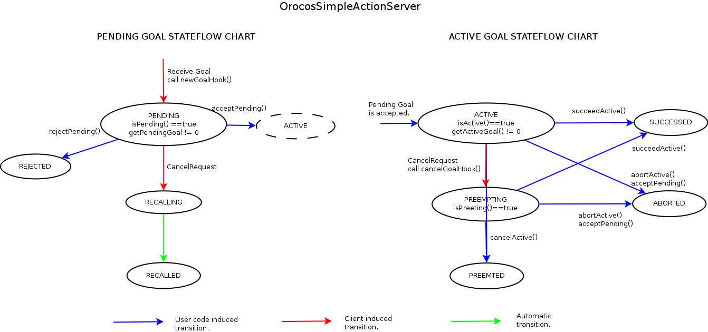

Задатчики (походки, анимации)
=============================

Этот документ описывает типовой интерфейс задатчика движения.
Задатчики формируют задающее воздействии для некоторого набора исполнительных органов.
Для кинематических цепочек выдается желаемая поза в угловой или декартовой системе координат. В остальных случаях тип задания зависит от реализации.

Набор интерфейсов сильно зависит от назначения. Принципиально выделяются три типа задатчиков:
1. **`Follow`** реализуют алгоритмы слежения, используют механизм портов для получения задающего воздействия из вне и операции для активации и деактивации. Примеры: `HeadFollowPoint` (следить за точкой), `FollowJointState` (следить за позой).
1. **`Move`** реализуют алгоритмы дискретного позиционного управления. Используют механизм `actionlib` для получения задания. Примеры: `MoveJointState` (переместить в заданную позу).
1. **`Execute`** реализуют алгоритмы непрерывного программного управления (исполнение известной траектории). Используют механизм `actionlib` для получения задания. Примеры: `ExecuteJointTrajectory` (исполнение `JointTrajectory`).

## Разрешение конфликтов

Разрешение конфликтов ресурсов обеспечивается [арбитром и клиентским плагином](components-resource-control).

## Способ взаимодействия с верхним уровнем

Основной способ взаимодействия с верхним уровнем `actionlib`. Он позволяет высшему уровня контролировать исполнение поставленной задачи,
реагировать на ситуацию, когда ее исполнения прервано. 
* Если задача может быть передана задатчику одним сообщением (траектория, целевая поза), то используется советующий тип действия (например, `control_msgs::FollowJointTrajectory`).
* Если требуется просто активировать контроллер (с указанием или без списка выделяемых ресурсов), то используется действие `sweetie_bot_resource_control_msgs::SetOperational`. 
    Пример: `FollowPose`, когда он активен для данной кинематической цепочки, то ее конец отслеживает заданную позу.

## Типовой интерфейс задатчика

Далее перечислены большинство возможных способов взаимодействия, реальный компонент реализует только часть.

### Входные порты

Синхронизация

1. `sync` (`TimerEvent`, EventPort) --- синхронизация таймера, по этому сообщению делается шаг по времени и начинается вычисление задающего воздействия.

Текущее состояние робота

1. `joints_sorted` (`JointState`) --- состояние робота в угловой СК (желаемое с предыдущего шага или реальное по датчикам), полное, отсортированная по кинематическим цепочкам.
1. `limbs_sorted` (`RigidBodyState`) --- состояние робота в декартовой СК (желаемое с предыдущего шага или реальное по датчикам), полное (ноги, голова), сортированное по цепочкам.
1. `support_sorted` (`SupportState`) --- список точек касания по сенсорной системе.

Интерфейс высшего уровня (порты используются в компонентах **слежения**)

1. `joints_ref` (`JointState`) --- желаемое положение звеньев.
1. `twist_ref` (`Twist`) --- желаемая скорость тела или конечности.

### Выходные порты

Задающее воздействие

1. `joints_ref` (`JointState`) --- задающее воздействие в угловой системе координат, неполная поза (предпочтительный вариант). Задает положение головы, ног, хвоста, глаз.
1. `imbs_ref` (`RigidBodyState`) --- задающее воздействие в декартовой системе координат (для походок, для остальных компонент использование нежелательно из-за неоднозначности).
1. `support_ref` (`SupportState`) --- расчетный список касаний (для походок, опционально).
1. `body_ref` (`RigidBodyState`) --- расчетное положение и скорость платформы (для походок, опционально).

### Операции

1. ТребуетЖ `bool poseToJointState(const RigidBodyState& in, JointState& out)` --- обратная кинематика

### Параметры

Параметры походки и анимаций, настраиваемые один раз при запуске.

1. `period` --- период дискретизации, должен совпадать с периодом таймера.

### Плагины

1. Требует загрузки: плагин клиента [подсистемы распределив ресурсов](components-resource-control) и предоставляемые им операции --- должен быть загружен в компонент.
2. Требует (опционально): [модель робота](plugin-robotmodel).

### Операции

Операции активации/деактивации задатчика.

1. `start/stop` --- стандартные операции запуска компонента используются для активации/деактивации.
1. `rosSetOperational()` (`std_srv::SetBool`) --- операция, совместимая с ROS, для активации компонента.

### Интерфейс `actionlib`

Используется для активации задатчика, через него же высший уровень информируется о результате.

**Одна цель** (предпочтительный вариант):

Предлагается использовать `OrocosSimpleActionServer` аналог класса [`SimpleActionServer`](http://docs.ros.org/api/actionlib/html/classactionlib_1_1SimpleActionServer.html),
скрывающий от пользователя взаимодействия с `GoalHandle` и клиентом арбитра ресурсов.  Он требет от пользовательского кода аналогичный набор callback.
1. `newGoalHook(Goal)` ---  получить задание (цель движения, его параметры).
2. `cancelGoalHook()` ---  прекратить исполнение задания (опционально).
3. `resourceChangeHook()` --- реакция на изменение состава выделенных ресурсов.

**Поддержка нескольких целей**:

1. `goalCallback(GoalHandle)` ---  получить задание (цель движения, его параметры).
1. `cancelCallback(GoalHandle)` ---  прекратить исполнение задания.
2.  Извещения о завершении, отказе исполнения осуществялется средствами `actionlib` через взаимодействие с `GoalHandle`.
Управление набором `GoalHandle` и их сотояниями ложится на пользователя. 

**`SetOperational`**

Компонент реализуется в виде наследника класса [`SimpleControllerBase`](components-simple-controller-base) из пакета `sweetie_bot_resource_control`.

### Семантика исполнения

После исполнения `configure` компонент готов к работе и запуску.

Переход к активному состоянию (формирует задающее воздействие) осуществляется вызовом `actionlib`, либо `start()` (эти механизмы исключают друг друга).
Проводится проверка возможности активации в данном состоянии робота, в зависимости от результата формируется отказ (`goal->setRejected` или возврат `false`), либо создается запрос ресурсов.

Непосредственный переход в состояние активное состояние и запуск компонента происходит по подтверждению выделения ресурсов (в `resourceChangeHook()` или путем мониторинга `isOperational`).

В активном исполняется основной код задатчика с периодом, определяемым таймером. Задаваемая поза `out_joints_ref` не должна существенно отличаться от текущей `in_joints`.
Этого можно достичь, используя [сервисы фильтров](library-filters), либо учитывая текущую позу при расчете задающей (например, компонент вычисялет смещение).
Если компонент формирует программную траекторию, то существенное отклонение текущей позы от задающей можно рассматривать как ошибочную ситуацию и прерывать исполнение компонента.
<!--Значения времени и номера периода дискретизации переносятся из `TimerEvent` в выходные сообщения.-->

По завершению движения, либо по требованию освобождения ресурсов производится остановка выполнения.
Производится информирование высшего уровня средствами `actionlib` (цель достигнута/отвергнута).

### Детали реализации.

Состояния "запущен" и "активен" не тождественны. Неактивный компонент не посылает задающее воздействие,
независимо от его состояния, а остановленный компонент не обрабатывает сообщения, включая сообщения `actionlib`.
Поэтому для обработки сообщений арбитра и `actionlib` задатчик должен быть запущен (нежелательно), 
либо такая обработка должна быть явно разрешена из `dataOnPortHook()` путем возврата `true` для соответствующих портов (желательно).

Слишком большое число одновременно запущенных задатчиков может вызвать проблемы.
Поэтому разумно запускать задатчик перед запросом ресурсов (из `goalCallback()`) и останавливать при деактивации (из `upadteHook`).
Однако первичные реализации можно делать на база постоянно запущенных задатчиков.

Пример взаимодействия с клиентским плагином арбитра ресурсов: [компонент переключения походок](components-resource-control).

Механизм плагинов в перспективе позволить усложнить протокол выделения ресурсов, не модифицируя сами компоненты задатчиков.
Также он избавляет программиста от необходимости проверять запросы на освобождение в каждой реализации задатчика.

### Исключения

Зависят от реализации.

## `OrocosSimpleActionServer` 

Класс-обертка для исходной реализации `ActionServer` для OROCOS. Поддерживает работу с одной целью, скрывает сложности взаимодействия с `GoalHandler`.
Принцип-работы близок к `SimpleActionServer` ROS в режиме с Callback, однако он предоставляет дополнительные средства доступа к ожидающей активации цели (PENDING).

### Интерфейс

0. `start`/`shutdown` --- запуск, остановка.
1. `bool isActive()` --- присутствует ли активная цель.
1. `bool isPreemting()` --- активная цель ожижает отмены по запросу клиента.
2. `bool isPending()` --- присутствует цель, ожидающая активации.
3. `boost::shared_ptr<const Goal> getActiveGoal()` --- возвращает активную цель, если есть.
3. `boost::shared_ptr<const Goal> getPendingGoal()` --- возвращает ожидающую активации цель, если есть.
3. `bool acceptPending(Result result)` --- принять ожидающую активации цель, ничего не делает, если такой цели нет. Меняет статус активной цели (если есть) на "прервана" (preemted) с результатом `result`.
3. `bool rejectPending(Result result)` --- отклонить ожидающую активации цель, ничего не делает, если такой цели нет.
3. `bool abortActive(Result result)` --- прервать (aborted) выполнение активной цели, ничего не делает, если такой цели нет.
3. `bool cancelActive(Result result)` --- отменить (canceled) выполнение активной цели, ничего не делает, если такой цели нет.
3. `bool succeedActive(Result result)` --- завершить выполнение активной цели, ничего не делает, если такой цели нет.
3. `void setGoalHook(boost::function< void()> newGoalHook)` --- функция будет вызываться при появлении новой (pending) цели.
3. `void setCancelHook(boost::function< void()> cancelGoalHook)` --- функция будет вызываться при отмене активной цели.

Функции типа `accept`/`reject` возвращают `true`, если совершают действие, иначе --- `false`. 

### Семантика исполнения

Одновременно могут храниться две цели: активная (ACTIVE) и ожидающую активации (PENDING).  Активная цель всегда одна. 
Ожидающая активации заменяет ее по вызовы `acceptPending()`.
Ожидающая цель тоже одна. Новая цель отменяет текущую ожидающую и занимает ее место. По этому событияю вызывается `newGoalHook`.

Диаграмма состояний `OrocosSimpleActionServer`:

### Пример использования

Пример использования: все цели требуют одникового набора ресурсов. 
Предполагается, что комонент всегда находится в сотоянии `Running`.

    void newGoalHook(pending_goal) {
        if (! условия исполнеия для pending_goal) {
            as.rejectPending(не выполнены условия запуска);
            return; //выполнеие активной цели, если была, продолжается
        }
        if (isOperational() && hasResources(нужные ресурсы)) {
            as.acceptPending(прервана другой целью); % заменяем одну цель на другую без запроса ресурсов.
    	}
    	else {
            rc.resourceChangeRequest(нужные ресурсы); // запрос набора ресурсов.
        }
    }
    
    bool resourceChangeHook() {
        if (hasResources(нужные ресурсы) {
            if (as.isPending()) {
                as.acceptPending(прервана другой целью); // прерываем активную цель, если была
                операции по запуску новой цели
            }
    		return true; 
        }
        else {
            rejectPending(нет ресурсов);
    		if (as.isActive()) {
                 операции по прекращению работы
                 as.abortActive(отобраны ресурсы);
            }
            return false;
        }
    }
    
    void cancelGoalHook() {
        операции по прекращению работы
        as.abortActive(отменена);
        stopOperational();
    }
            

## `SimpleControllerBase` 

Superclass for controller components which use actionlib SetOperational interface for activation.
It is derived from `RTT::TaskContext` and already provides logger and `sync` port with `period` property.

This class provides common functionality (actionlib and resource arbiter interations) for
controllers which are able to control arbitrary or specific set of resources. 
Such controllers can are activated or deactivated by SetOperationalGoal message which contains 
`resource` field with desired resource set (this value can be ignored by controller).

This class implements ActionServer interface and ResourceClientInterface, so a component subclass should
only implements following methods.

    bool configureHook_impl();
    bool processResourceSet_impl(const std::vector<std::string>& resource_set, std::vector<std::string>& desired_resource_set);
    bool startHook_impl();
    bool resourceChangedHook_impl(const std::vector<std::string>& desired_resource_set);
    void updateHook_impl();
    void stopHook_impl();
    void cleanupHook_impl();

Note that minimal implementation are already provided.

Also class provides Logger @c log object and @a controlled_chains and @a period properties.

### Detailed interface description

Note: subclass should not implement standard `configureHook()`, `startHook()` and etc. Use functions described below.

1. `bool configureHook_impl()` Called after `resource_client` and `ActionServer` are configured. Should contain component initialization.

2. `bool processResourceSet_impl(strings& goal_resource_set, strings& desired_resource_set)`
    Implement this function to restrict acceptible resources sets or enforce specific resource set.
    
    Always called after `configureHook_impl()` and before actual resource request. This function is used  
    to check if action goal is sane and to determine resources which should be requested.
    
    Minimal implementation sets `desired_resource_set equal` to `goal_resource_set` and return true.
    In more complex cases `goal_resource_set` should be checked if it comforms controller-specific 
    conditions and the actual resource set to request should be assigned to `desired_resource_set`
    
    `goal_resource_set` is the resource from `SetOperationalGoal` messages. `start()` operation uses default value from `kinematic_chains` property.
    `desired_resource_set` is the resource set which should be requested. 
    Function return true if `goal_resource_set` set is acceptible for component.

2. `bool startHook_impl()` is `startHook` implementation. Requested and acquired resource sets are not known yet. Return true to start component.

3. `bool resourceChangedHook_impl(const strings& desired_resource_set)` implements reaction on resource set change.
    Always called after `startHook_impl()` and `processResourceSet_impl()`. Acquired resource set can be accessed via `resource_client` plugin interface.
    This function must reinitialize controller to run with different resource set or return failure.

    `desired_resource_set` is resource set requested from arbiter. It is the same set which was returned in second parameter of `processResourceSet_impl()`.
    Function shuld return true to activate controller.

4.  `void updateHook_impl()`
5.  `void stopHook_impl()`
6.  `cleanupHook_impl()`

### Example

`FollowPose` controller make one of end effectors to follow provided pose. Only one of kinematic chains can be controlled at time.

    bool configureHook_impl() {
       // memory reservation
       // properties check
    }

    bool processResourceSet_impl(const std::vector<std::string>& resource_set, std::vector<std::string>& desired_resource_set) {
        if (resource_set.size() != 0) return false; // check size
        if (robot_model->getChainIndex(resource_set[0]) == -1) return false; // check if valid kinematic chain name supplied
        desired_resource_set = resource_set;
        return true;
    }

    bool startHook_impl() {
        // reset component state before start 
    }

    bool resourceChangedHook_impl(const std::vector<std::string>& desired_resource_set) {
        if (resource_client->hasResource(desired_resource_set[0])  
        // NOTE: we already checked it size of `desired_resource_set` before in `processResourceSet_impl()` call.
        {
           // adjust commponent state to the new controlled chain.
        }
        else {
           return false;
        }
    }

    void updateHook_impl() {
        // port porcessing
        // desired pose calculatrin
        // publish results
    }

