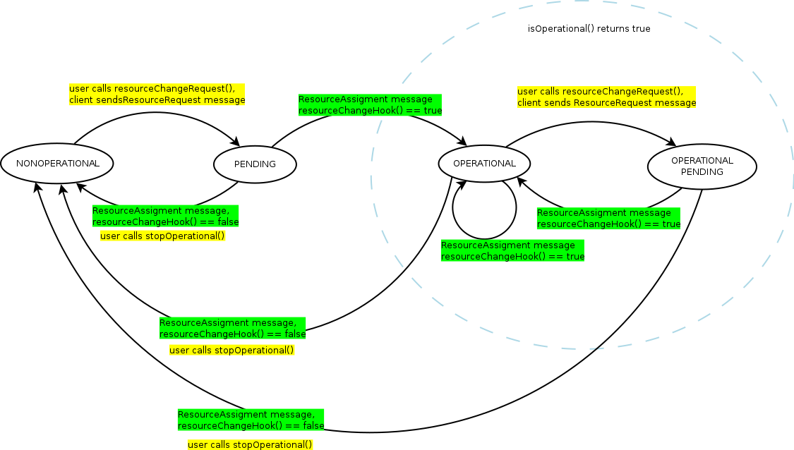

Арбитр ресурсов
======================

Описывается реализация переключения походок, которая включает два элемента: арбитр и клиентская подсистема задатчика. 
Обмен осуществляется при помощи портов и сообщений, описанных ранее в [переключении задатчиков](gait-switching).
Выбрана максимально асинхронная схема обмена, чтобы не блокировать компонент задатчика.

Варианты реализации клиентской части:
1. Наследник `TaskContext`, от которого наследуются все компоненты-задатчики. (Статическое связывание). 
2. Компонент, куда пользовательский код загружается как плагин. 
    (Неудобно из-за отсутствия полного доступа к кода задатчика к компоненту, весь интерфейс задатчика окажется в пространстве имен сервиса).
3. Клиентская часть является сервисом. (Динамическое связывание, удобно для тестирования задатчика отдельно, но сложности с взаимодействием).

Далее рассматривается **клиентская часть-сервис**, остальные реализуются аналогично.
Для взаимодействие используется интегральный тип данных `ResourceList`:

Клиентская  часть: сервис `ResourseСlient`
-------------------------------------------

Внешний интерфейс (связь с арбитром):

### Выходные порты:

1. `resource_request` (`ResourseRequest`) --- запросы ресурсов к арбитру (вариант только с портами)
1. `resource_requester_status` (`ResourseRequesterStatus`) --- изменение состояния компонента после перераспределения ресурсов или при деактивации.

### Входные порты:

1. `resource_assigment` (`ResourseAssigment`) --- ресурсов по компонентам.

### Операции:

**Внимание!** В соответствие с соглашениями надо удалить из внешнего интерфейса не предназначенные для использования другими 
компонентами операции. Их метка "Предоставляет" заменена на "Метод" или "Предоставляет (удалить)".

**Внутренний интерфейс (связь с кодом задатчика)**:

1. Метод: `uint32 requestResources(strings req [, ints pri1, ints pri2] )` --- изменить состав ресурсов, формирует запрос `ResourseRequest` и отправляет его арбитру, не для внешнего использования. Возвращает идентификатор запроса (`request_id` см. в [переключение задатчиков](gait-switching)) или ноль, если запрос не может быть выполнен (порт не подключен).
1. Метод: `bool stopOperational()` --- уведомить арбитр о деактивации (посылает `ResourseRequesterStatus`), не для внешнего использования.
1. Предоставляет: `bool isOperational()` --- возвращает true в состояние "opertional" и "operational pending".
1. Предоставляет: `bool getState()` --- возвращает состояние: "non operational", "pending", "opertional", "operational pending"
1. Предоставляет: `bool hasResource(string res)`, `bool hasResources(strings  res)`
1. Предоставляет: `strings listResources()` --- возвращает список ресурсов, которыми владеет компонент. Не РВ.

1. **Обработка сообщений арбитра**
     
     Метод: `void step()` --- функция, которая должна периодически вызываться в `updateHook()`.
    
    ИЛИ

     Устанавливает callback `processResourceAssigment` на входной порт `resource_assigment`.

1. **Средства уведомления пользовательского кода о изменении набора ресурсов**:

    1. Требует (опционально, *удалить*): `bool resourceChangeHook()` --- операция компонента-владельца сервиса, используемая как пользовательский callback, 
        вызываемая при изменении состава ресурсов.  Пользовательский код возвращает `true`, если компонент остается активен. 
    2. Требует (опционально, *удалить*): `void stopOperationalHook()` --- операция компонента-владельца сервиса, используемая как пользовательский callbcak, 
        вызываемый при переходе в состояние "non opertional".
    Плагин сам проверяет наличие этих операций в интерфейсе компонента  и присоединяется к ним.

     ИЛИ
    
    1. Метод: `void setResourceChangeHook(boost::function<bool()> resourceChangeHook)`
    2. Метод: `void setStopOperationalHook(boost::function<void()> stopOperationalHook)`

### Семантика исполнения

**`requestResources`** формирует запрос `ResourseRequest` и отправляет его арбитру.  Эта функция вызывается кодом пользователя  после проверки условий активации, сигнализирует о переходе в состояние ожидания активации (pending) из состояний "активен", "не активен". А состояние "pending" игнорируется.

**`stopOperational`**  сигнализирует о деактивации. Вызывается пользовательским кодом для перехода в состояние "не активен" (конец движения, отмена действия).

**`step`** должна вызываться в начале `updateHook()` для обработки сообщений `ResourseAssigment`. 
Альтернативный вариант c `processResourceAssigment` предполагает использование EventPort с Callback функцией для вызова обработчика.  Для  возможности обработки сообщений компонент должен быть запущен, либо обработка сообщений должна быть явно разрешена через `dataOnPortHook` не только в режиме "запущен".

**`step`** разбирает полученный список ресурсов и вызывает пользовательский `hookResourceChange`,  чтобы определить, согласен ли компонент со списком  выделенных ресурсов. 
Если `hookResourceChange` не реализован, то проверяет наличие последних запрошенных ресурсов 
и на основе этого меняет состояние задатчика и посылается `ResourseRequesterStatus`. 

Диаграмма состояний клиента приведена ниже:

### Детали реализации.

Вероятно, набор ресурсов проще всего хранить и передавать в `set<string>` или `map<string>`

Пример реализации задатчика:

    bool startHook() {
         vector<string> res = { "leg1", "tail" };
         req resource_client->requestResources(res);
    }
    bool hookResourceChange() {
        return resource_client->hasResource("leg1") && ... 
    }

    void updateHook() {
        resource_client->step();

        if (sync_port.read(sync_msg, false)) {
            if (resource_client->getState() & OPERATIONAL) {
                ...  ref_joints_port.write(ref_joints);
                if (resource_client->hasResource("tail") {
                    ...
                }
            }
            else if (resource_client->getState() == NONOPERATIONAL) {
                 this->stop();  // stop component when it is nonoperational
            }
        }
    }

    stopHook() {
         resource_client->stopOperational();
     }

Серверная часть: компонент `resources_arbiter`
---------------------------------------------

Компонент регистрирует все задатчики, осуществляет прием извещений о изменении состава ресурсов/активных компонент, 
осуществляет перераспределение ресурсов.

### Входные порты

1. `resource_request` (`ResourseRequest`) --- запросы ресурсов к арбитру (вариант только с портами).
1. `resource_requester_status` (`ResourseRequesterStatus`) --- изменение состояния компонента после перераспределения ресурсов или при деактивации.

### Выходные порты

1. `resource_assigment` (`ResourseAssigment`) --- ресурсов по компонентам.
1. `controllers_state` (`ControllerState`) --- состояние задатчиков.

### Операции:

1. Предоставляет `resourceRequest` (`uint32 resourceRequest(ResourseRequest)`) --- запросы ресурсов к арбитру, возвращает номер запроса (вариант c операциями)

### Параметры

1. `strings list_orocos` --- список компонент-задатчиков OROCOS (опционально, чтобы предварительно выделить память под структуры и проверять корректность запросов).
1. `strings resources` - список ресурсов (опционально, для выделения памяти и проверки корректности запросов). 

### Операции

1. `assignAllResorsesTo(string component)` --- передать все ресурсы заданному компоненту или никому (`noone`)

### Семантика исполнения

Компонент реализует семантику **арбитра ресурсов без приоритетов с возвратом владения**. 

Основной код --- обработка запросов --- содержится в **`updateHook`**. Семантика исполнения подробно расписана в [переключении задатчиков](gait-switching). Некорректный запрос приводит к ошибке.

### Детали реализации

Для контроля раундов испльзуется механизм `request_id`, генерируемых на стороне клиентов.

Структура харнения информации о задатчиках `map<string,ClientInfo>`:
* `state` --- состояние (активен, ожидает активации, неактивен), 
* `last_request` --- последний запрос, битовый вектор,
* `request_id`,
* `seq` --- номер последнего запроса (номер глабальный).

Структура харнения информации о ресурсах `map<string,ResourceInfo>`:
* `index` --- индекс ресурса в битовом векторе,
* `owner` --- имя задатчика-владельца или строка `none`.

Способ хранения оптимизирован под доступ по имени.

### Исключения и ошибки

Предупреждения:
1. Некорректное имя компонента в запросе.
1. Некорректное имя ресурса в запросе.

