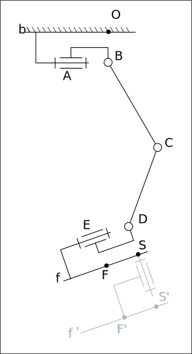

Аналитическое решние одно задачи обратной кинематики
====================================================

Основная идея упрощения задачи обратной кинематики заключается в использовании декомпозиции.
Исходная задача разбивается на несколько задач пониженной размерности, поиск решения которых проходит значительно проще.
Важным частным случаем, когда декомпозиция возможна, является манипулятор с кистью. 
Наличие кисти означае, что оси последних трех суставов пересекаются в одной точке.

С случае конструкции ноги 2-ого прототипа роль кисти играет ступня. Две оси пересекаются в одной точке, 
а в качестве третьей рассматривается поворотная платформа (не реализована, но предполагается).

Кинематическая схема ноги изображена на рисунке.

Точки *A*, *B*, *C*,  *D*, *E* являются центрами суставов, конструкция ноги такова, что они лежат в одной плоскости.
Точка *С* явдляется точкой крепления кисти: тут пересекаются три оси, включая ось виртуальной степени свободы (показано серым). 
*b* --- основание робота (тело), *f* --- стопа реальная, *f'* --- стопа фиктивная. В качестве точки *F* и *F'* может быть выбрана 
произвольная точка стопы. Для простоты следует 

Решение задачи кинематики

**Дано**: желаемая поза стопы *b* (в виде подожения точки *F'* и ориентации) относительно основания *b*.

**Задача**: определить угловые координаты манипулятора.

**Ход решения**:

1. Определить координаты точки *С* относительно тела основания *b*.  Т.к. стопа *f*  --- твердое тело и конструкция ее такова, что вектор *S'C* жестко связан со стопой и имеет известную длину.
2. Определить вектор *BD* (точка *B* связана с основанием *b*), 
3. По треугольнику *BCD* опрелить угол *BCD* (угол  третьего сустава).
2. Определить угол первого сустава, по вектору *BD*.
2. Определить угол второго сустава, как сумму или разность углов *ABD* и *BCD* (неоднозначность).
3. Спроецировать вектор *DS* на плоскость *ABCDE*. Рассчитать угол четвертого сустава и пятого сустава.

