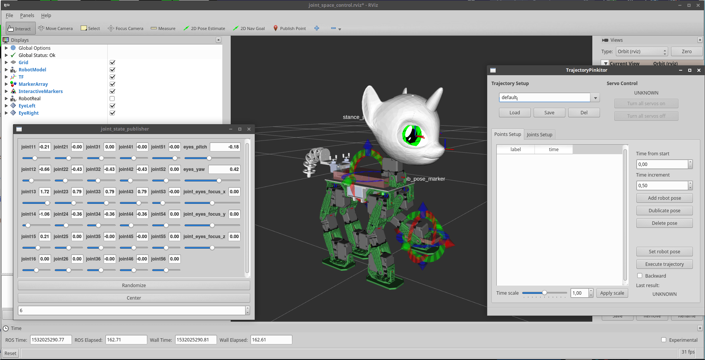

# Sweetie Bot robot control system

This control system aimed to provide easy manual and automatic control of Sweetie Bot Proto2 robot. 

It works on top of [Robot Operation System (ROS)](http://wiki.ros.org/ROS/Introduction) and [OROCOS toolchain](http://www.orocos.org/wiki/orocos/toolchain/getting-started).



It can works in two modes - real and virtual. 

1. In a virtual mode it runs on PC computer. You can program robot behaviors in a virtual enviroment (3d model). 
2. In a real mode, virtual enviroment can be connected to the real robot hardware.

This control system supports three control modes right now:

1. Joints control
2. Full body control
3. Finite state machine control (flexbe)

Watch the Software demonstration video [here](https://www.youtube.com/watch?v=FTKn_fK0Puo):

[](https://www.youtube.com/watch?v=FTKn_fK0Puo)

# Installation

We build packages for Ubuntu 16.04, Debian 9 Stretch and Rasbian.
To install binary packages you need to add two repositaries:

1. Sweetie Bot Project repository
2. Official ROS repositary for dependencies

### 1. Add apt keys

```
$ sudo apt-key adv --keyserver keyserver.ubuntu.com --recv-keys 5523BAEEB01FA116
$ wget -O - https://raw.githubusercontent.com/slavanap/ros-build/master/slavanap.key | sudo apt-key add -
```

### 2. Setup apt

```
$ sudo -i
# echo "deb http://packages.ros.org/ros/ubuntu $(lsb_release -sc) main" > /etc/apt/sources.list.d/ros-latest.list
# echo "deb http://sweetie.bot/apt $(lsb_release -sc) main" > /etc/apt/sources.list.d/sweetie-bot.list
```

### 3. Install

```
$ sudo apt-get update
$ sudo apt-get install ros-lunar-sweetie-bot ros-lunar-sweetie-bot-base
```

### 4. Setup the workspace

```
mkdir -p ~/ros/sweetie_bot/src
cd ~/ros/sweetie_bot/src
git clone git@gitlab.com:sweetie-bot/sweetie_bot_sounds.git
git clone git@gitlab.com:sweetie-bot/sweetie_bot_proto2_movements.git
git clone git@gitlab.com:sweetie-bot/sweetie_bot_flexbe_behaviors.git
git clone https://github.com/lucasw/rviz_textured_quads.git
cd ~/ros/sweetie_bot
source /opt/ros/sweetie_bot/setup.bash
catkin_make
```

### Build from source

Building from source can be tricky, this software have a lot of dependencies. See this [repository](https://github.com/slavanap/ros-build) and this Docker images [here](https://hub.docker.com/r/slavanap/ros-build/tags/).

## Build status

### Base package

Platform        | Status
----------------|--------------
Desktop         | [](https://travis-ci.org/slavanap/ros-build)
Raspberry Pi 3  | [](https://travis-ci.org/slavanap/ros-build/branches)

### Main package

[](https://gitlab.com/sweetie-bot/sweetie_bot/pipelines)
