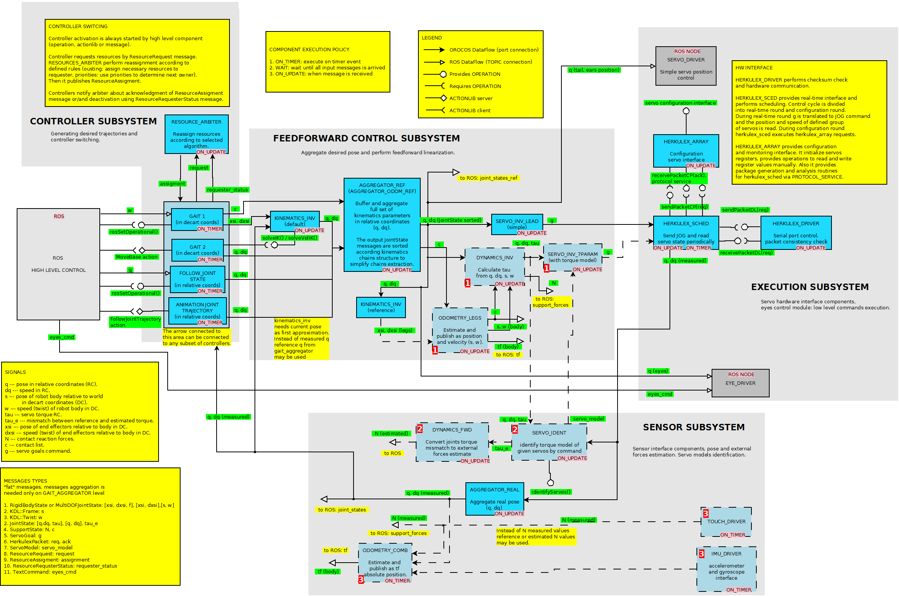

Алгоритмы компенсации динамики робота
--------------------------------------

Данный документ содержит концепт системы управления движением с учетом динамики.
Он базируется на системе управления NimbRo-Op (в части придания упрогости звеньев) [Compliant Robot Behavior using Servo Actuator Models identified by Iterative Learning Control] и 
[курсе лекций](http://www.rsl.ethz.ch/education-students/lectures/robotdynamics.html) 
в части решения обратной задачи динаики (рассчета усилий приводов по желаемой скорости). 

### Задачи решаемые подсистемой

1. Обеспечить исполнение траекторий движений (в терминах угловой или абсолютной системы координат) исполнительной системой робота. 
    Для этого требуется формирвать команды приводам в соотсветвие с динамической моделью робота, моделью привода и силы трения.
    Фактически решается задача обращения для этих систем.

2. Обеспечить упругость (compliance) за счет приводов. Это означает, что конечности робота ведут себя как немного подпружиненые. 
    Это позволяет решать множество проблем с естественностью походки (неточная постановка ног), снизить энергопотребление, 
    сделать движения робота менее жесткими.

3. Идентификация неизвестных параметров приводов (модели силы трения) без разборки робота.

4. Детектирование внешних сил, дествующих на робота. В частности ударов о препятсвие, постановка ноги, внешнее силовое воздейсвие.

5. Обеспечение выполнения условий равновесия при походке (центр масс в пределах площади опоры, точка нулевого момента в пределах площади опоры).
    Для исполнения этой цели требуется уметь рассчитывать силы реакции опоры.

Система управления движением
---------------------

Система нулевого цикла
---------------------

Текущая система управления движением, не учитывает динамику, не обеспечивает упругость.

#### Основная идея

Формируемая на выходе агрегатора [`agregator_ref`](components-agregator-gait) желаемая поза (`q` (`JointState`) --- углы) 
транслируется в команды привода (`g` (`ServoGoal`) --- пара: целевая позиция и время ее достижения) модулем
обращения приводов [`servo_inv_lead`](components-servo-inv) каждый период дискретизации.

#### Особенности

1. Требуется задавать только желаемую позу в угловой СК.

2. `servo_inv_lead` берет упреждение при вычислении целевой позиции приводов на 1-2 период дискретизации, чтобы обеспечить плавное движение в случае потери пакета.

3. Коэффициент ПИД-регуляторов приводов должны быть достаточно велики, что обеспечить точность исполнения команд. В результате упругость в суставах отсутсвует.

Система первого цикла
---------------------

Система управления движением, учитывающая динамику робота и приводов. Обеспечивает упругость, потенциально может содержать модуль оценки внешних сил. 

### Необходимые условия реализации

1. Наличие достоверно динамической модели робота в URDF формате для: решения задачи обращения 

2. Задающее воздействие должно включать позиции, скорости и ускорение. Они используются для вычесления заданий по силе для приводов. 
    Возможно также численное определение ускорения путем интегрирования скорости.  

3. Требуется знать модели приводов и силы трения. Эту задачу предлагается решать методом идентификации. При идентификации необходимо подавать тестовую 
    последовательность и опрашивать состоние приводов.  

4. Оределение внешних сил возможно только при опросе приводов. При этом требуется знать позиции, скорости и ускорения. 

#### Основная идея

Агрегатор [`agregator_odom_ref`](components-agregator-gait) формирует полную желаему позу робота `q`, `dq` в угловой СК (`JointState`) и рассчетную скорость и позицию тела робота `s`, `w` в абсолютной СК.
Скорость и позиция тела робота может формироваться либо самими задатчиками, либо россчитываться из предполагаемых контактов с опорной поверхностью.

Эта поза (`q`, `dq`, `s`, `w`) поступает на вход модуля обратной динамики [`dynamics_inv`](components-dynamics), который по динамической модели робота [1, формула (3.99)] рассчитывают необходимые усилия 
приводов `tau` и опционально силы реакции опоры `N` в точках контакта. Для рассчетов динамики придется вычислять ускорения, численно дифференциируюя скорость.
Динамическая модель робота загружется из URDF.

Компонент обращения приводов [`servo_inv_nimbro`](components-servo-inv) по желаемым позициям `q`, скоростям `dq` и рассчетным усилиям приводов `tau` определяют команды для приводов, 
опираясь на его модель и модель силы трения. Здесь используется модель из [Compliant Robot Behavior using Servo Actuator Models identified by Iterative Learning Control].
Модели приводов загружаются собщениями `sm` (`ServoModel`) либо идентификатором, либо из файла.

Компонент идентификации и рассчета ошибки пресказания [`servo_ident`](components-servo-inv) способен по внешней команде проводить идентификацию заданной группы приводов. 
На вход получет измеренную позицию и скорость (`q meashured`, `dq meashured` --- (`JointState`)), рассчетные моменты (`tau` (`JointState`)).
он передает сообщение `ServoModel` компоненту `servo_inv_7param`. Возможна загрузка и сохранение моделей из параметров. 
Также компонент рассчитывает расхождение `tau_e` между рассчетным моментом по динамической модели и задающему воздействию (`tau`) и по модели привода.
Это расхождение явялется оценкой внешних сил, действующих на конечность.

Компонент `dynamics_fwd` пересчитывает моменты приводов в значения эквивалентных внешних сил, приложенных к конечности.

#### Особенности

1. Не ясно, следует ли включать копыто в расчеты по динамической модели. Вероятно, следует. т.к. требуется обеспечить упругость и в этом суставе. 

2. На первых этапах удобно обойтись без идентификатора и загружать модель в xml файла методом сериализации OROCOS.

3. Скорость и ускорение платформы необходимы для расчета сил в системе со подвижной платформой.

4. Модуль одометрии предлагается выполнить как плагин для агрегатора. Это решает отчасти проблему синхронизации.

5. Алгоритм одометрии прост ([не очень](components-odometry-fake): он определяет 2-3-4 опорных ноги и полагает, что они касаются земли. Возможно получение информации о касании от модуля походки.

6. В указанной схеме Якобиан надо вычислять несколько раз в разных модулях. Проблема может быть решена за счет сервиса прямой кинематики (?), либо публиковать якобиан на уровне агрегатора. 
    На текущий момент предлагается оставить как есть.

Система второго цикла
---------------------

Полноценное управление походкой с учетом динамики робота. Помимо возможностей второго цикла обеспечивает исполнение условий касания (силы реакции опоры положительны, силы трения в конусах),
и исполнения необходимого условия динамического равновечия: ZMP над площадью опоры.

### Необходимые условия реализации

1. Управление осуществляется по ускорению `dw` платформы, свободных конечностей и список контактов. В этом смысле система управления выступает, как линеаризующая обратная связь.
    Возможно также использование и угловых ускорений для свободных кончностей, но это уменьшает возможности системы задействовать их для поддержания равновесия.
    
2. Требуются динамическая модель (URDF), модели приводов (идентификация или сохраненные).

3. Для целей идентификации и оценки внешних сил требуется измерять позиции, скорости и ускорения приводов.

5. Возможности управления движением конечностей, управляемых в угловой СК ограничены зонами сингулярности якобиана. Надежно ими можно управлять только в зоне "шаговых движений",
    сложные жесты делать затруднительно.

#### Основная идея

В целом повторяет систему второго цикла. Основное отличие в том, что задающее воздействие представлено в абсолютной СК и у системы управления есть 
возможность выбирать угловые скорости и ускорения. 

Компонент `agregator_dynamics_ref` получает на вход от задатчика-стабилизатора походки и других задатчиков желаемое ускорение платформы `dw`, 
ускорение свободных конечностей `dw` (в абсолютной СК или угловой) и список конечостей в состоянии контакта.

Для 3-х векторов `du` (ускорение платформы и ускорения приводов), 
`tau` (моменты приводов), `N` внешние силы в точках контакта система управления движением решает последовательно достигая следующих целей:

1. выполнение уравнений динамики,
2. выполнение ограничений на скорост для точек контакта,
2. ограничения на моменты приводов,
3. условие положительности сил нормального давления опоры, условие непроскальзывания (не выход за конус силы трения),
4. условие на траекторию точки нулевого момента,
5. обеспечение заданного ускорения платформы,
6. обеспечение заданного ускорения свободных конечностей .

Задача с меньшим номером обладает более высоким приоритетом. Это означает, что задание по ускорению не может повлиять на условия равновесия 
(ограничения на силы реакции и точку нулевого момента). 

На выходе этого компонента получается задающее воздействие для приводов c их моментами (`q`, `dq`, `tau`) и рассчетная траектория движения платформы (`s`, `w`),
Тем самым он полностью заменяет агрегатор желаемой позы.

<!--которые подаются на агрегатор `agregator_odom_ref` и через него на `servo_inv_nimbro`. В такой конфигурации компонент `dinamics_inv` не нужен, либо -->
<!--не осуществляет расчетов. То же кассается встроенной одометрии `agregator_odom_ref`.-->

#### Особенности

1. Движение может быть задано в декартовой или угловой системе координат путем указания ускорения. Однако отработка движений в угловой СК может быть неточна, если есть более приоритетные цели

2. Т.к. задающее воздействие --- ускорение, возникают сложности с интеграцией в исходную концепцию системы управления движенем. 
    
3. Задающие воздействия могут менять род (уловые координаты/абсолютные коордивты), это порожлает разные задачи оптимизации для каждого случая.
    Одной из частных проблем является необлодимость знания производной якобиана по времени.

3. Определенную сложность представляет управление ориентацией копыта: оно требует контроля ориентации в точки контакта. Если ее не контролировать 
(считать, что контакт нахоится в точке пересечения осей "кисти" копыта), то после решения задачи оптимизации требуется рассчитывать еще команды для ориентации копыта в нужном подожении.

5. Обсчет управляемых в угловой системе координат конечностей тоже можно поместить в указанный стек задач. Однако, тогда задатчик должен выдавать ускорение
     и из-за системы приоритетов тлчное исполнение задания не может быть гарантированно. Однако множество возможных комбинаций заставляют выбирать
     между гибкостью и сложностью.

6. Описаная система не является стабилизатором, это feedforward control, как и система второго этапа) только с дополнительными ограничениями. 

